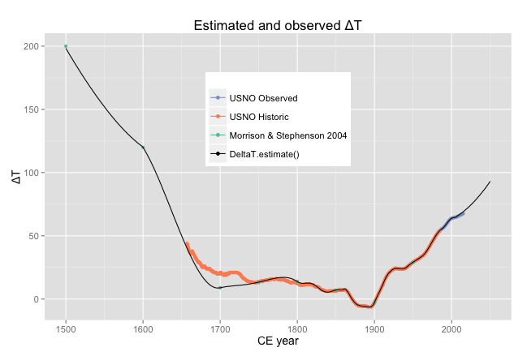

# solarpositioning

 [](https://search.maven.org/search?q=g:net.e175.klaus%20a:solarpositioning)

A Java library for finding topocentric solar coordinates, i.e. the sun’s position on the sky at a given date,
latitude, and longitude (and other parameters), as well as times of sunrise and sunset. Calculations are based on 
well-known, peer-reviewed algorithms: [SPA](http://dx.doi.org/10.1016/j.solener.2003.12.003) by Reda and Andreas and,
alternatively, [Grena/ENEA](http://dx.doi.org/10.1016/j.solener.2012.01.024) by Grena. More than 1000 test points are
included to validate against the reference code and other sources.

## Usage

### Maven coordinates

```xml

<dependency>
    <groupId>net.e175.klaus</groupId>
    <artifactId>solarpositioning</artifactId>
    <version>0.1.7</version>
</dependency>
```

### Code

```java
import net.e175.klaus.solarpositioning.*;

import java.time.ZonedDateTime;

public class App {
    public static void main(String[] args) {
        ZonedDateTime dateTime = new ZonedDateTime.now();

        AzimuthZenithAngle position = SPA.calculateSolarPosition(
                dateTime,
                48.21, // latitude (degrees)
                16.37, // longitude (degrees)
                190, // elevation (m)
                DeltaT.estimate(dateTime.toLocalDate()), // delta T (s)
                1010, // avg. air pressure (hPa)
                11); // avg. air temperature (°C)

        System.out.println(position);
    }
}
```

### Requirements

To run: Java 8 or newer. No additional runtime dependencies.

To build from source: Java 9 or newer, as the -release flag for javac is used.

### Which algorithm should I use?

* For many applications, Grena3 should work just fine. It's simple, fast, and pretty accurate for a time window from 2010 to 2110
  CE.
* If you're looking for maximum accuracy or need to calculate for historic dates, use SPA. It's widely considered a
  reference algorithm for solar positioning, being very accurate and usable in a very large time window. Its only
  downside is that it's relatively slow.

### How do I get the time of sunrise or sunset?

The SPA class includes a method to calculate the times of sunrise, sun transit, and sunset in one fell swoop:

```java
SunriseTransitSet res=SPA.calculateSunriseTransitSet(
        dateTime,
        70.978056, // latitude  
        25.974722, // longitude
        69); // delta T
```

Notes:

* The times of sunrise and sunset may be null if the sun never sets or rises during the specified day (i.e. polar days
  and nights).
* Calculation is based on the usual correction of 0.8333° on the zenith angle, i.e. sunrise and sunset are assumed to
  occur when the center of the solar disc is 50 arc-minutes below the 90° horizon.
* Sunrise and sunset times may differ from those given by other sources. If you feel there's
  something wrong with the results of this library, please make sure to compare with a reputable source such as
  the [NOAA calculator](http://www.esrl.noaa.gov/gmd/grad/solcalc/) and not one of the many quick-and-dirty algorithms
  found on the Web.
* As a general note on accuracy, Jean Meeus advises that "giving rising or setting times .. more accurately than to the
  nearest minute makes no sense" (_Astronomical Algorithms_). Errors increase the farther the position from the equator,
  i.e. values for polar regions are much less reliable.
* The goal of this implementation is to stay close to the reference implementation of SPA, using other sources for
  sanity checks only.

### What's this "delta T" thing?

See [Wikipedia](https://en.wikipedia.org/wiki/ΔT) for an explanation. For many simple applications, this value could be
negligible as it's just over a minute (circa 69 seconds) as of this writing. However, if you're looking for maximum
accuracy, you should either use a current observed value (available from e.g. the US Naval Observatory) or at least a
solid estimate.

The DeltaT class provides an estimator based on polynomials fitting a number of observed (or extrapolated) historical
values, published by [Espenak and Meeus](http://eclipse.gsfc.nasa.gov/SEcat5/deltatpoly.html) in 2007 and slightly
updated by [Espenak](https://www.eclipsewise.com/help/deltatpoly2014.html) in 2014. Here's a plot of its output compared
with some published ΔT data:



### Is the code thread-safe?

Yes. None of the classes hold any mutable shared state.
